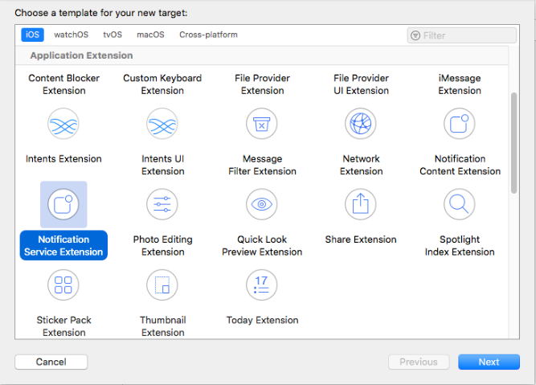

# Push-Notification
## iOS Push Notification with Notification Service Extension and content Extension

When push notification arrives in an iOS app,  you may want to be able to response with text.
Apple allows apps to do that using new Notification Service Extension.

The Following guide will help you to set up a project.

### Create Notification Service Extension
After you have successfully created the iOS application you need to create a notification service extension. Here are the steps of how to create a notification service extension.

1. In the Xcode menu, go to File > New > Target.

2. Select the Notification Service Extension.

3. Gives the name of the Extension service and click the finish button.

After you create iOS application and Notification service extension, you will see the two target in two new files for notification service. Here are two new files.
target window in add capabilities by clicking "+" button and add group.

after add group again click on add capabilities add push notification and background modes in select "remote notification"

### Get the permission of Push notification in application.

After complete the setup, we need to get permission for the push notification service in the application. We are adding permission code of push notification in AppDelegate.swift file. below is a code of how to get push notification permission in the application.

    func register(){
        UNUserNotificationCenter.current().delegate = self
        let authOptions: UNAuthorizationOptions = [.alert, .badge, .sound]
        UNUserNotificationCenter.current().requestAuthorization(
            options: authOptions,
            completionHandler: {_, _ in
                let replyAction = UNTextInputNotificationAction(identifier: "ReplyAction", title: "Reply", options: [])
                let openAppAction = UNNotificationAction(identifier: "OpenAppAction", title: "Open app", options: [.foreground])
                let quickReplyCategory = UNNotificationCategory(identifier: "QuickReply", actions: [replyAction, openAppAction], intentIdentifiers: [], options: [])
                UNUserNotificationCenter.current().setNotificationCategories([quickReplyCategory])
                
                UNUserNotificationCenter.current().getNotificationSettings { (settings) in
                    guard settings.authorizationStatus == .authorized else { return }
                }

            })
        UIApplication.shared.registerForRemoteNotifications()
    }
    
    
   
   #### above register method call in  UIApplication, didFinishLaunchingWithOptions launchOptions: in this method.
    
   ##### after register you want get Device token .

    func application(_ application: UIApplication,didRegisterForRemoteNotificationsWithDeviceToken deviceToken: Data) {
        let tokenParts = deviceToken.map { data in String(format: "%02.2hhx", data) }
        let token = tokenParts.joined()
        print("My Device Token: \(token)")
    }
    
    func application(_ application: UIApplication,didFailToRegisterForRemoteNotificationsWithError error: Error) {
        print("Error registering notifications: \(error)")
    }
    
    
    
   ## Now configure NotificationService.swift file
   
       override func didReceive(_ request: UNNotificationRequest, withContentHandler contentHandler: @escaping (UNNotificationContent) -> Void) {
        self.contentHandler = contentHandler
        bestAttemptContent = (request.content.mutableCopy() as? UNMutableNotificationContent)
        
        if let bestAttemptContent = bestAttemptContent {
            // Modify the notification content here...
            bestAttemptContent.title = "\(bestAttemptContent.title) [modified]"
            serviceManager.getRequest(url: "register?msg=myData") { response , error in
                print(response ?? "")
                print(error ?? "")
                print(response?["data"])
            }
            contentHandler(bestAttemptContent)
        }
    }
    
    
  ### above code in api call manage for push notification is push on screen and above method call
    
  ### after long press and view on pushnotification open text view and call this method in Notification Content Extantion file for push your message.
  
    func didReceive(_ response: UNNotificationResponse, completionHandler completion: @escaping (UNNotificationContentExtensionResponseOption) -> Void)
    {
        if let textResponse = response as? UNTextInputNotificationResponse, let txt = textResponse.userText.addingPercentEncoding(withAllowedCharacters: .urlQueryAllowed) {
                    serviceManager.getRequest(url: "register?msg=\(txt)") { response , error in
                        print(response ?? "")
                        print(error ?? "")
                        print(response?["data"])
                        completion(.dismiss)
                    }
                }
    }
}

## Notification Payload Sample
        
  A very important step for sending media attachment is the mutable-content key in the push payload from the server. So let’s take a look at this example payload:

This payload is used software of knuff.

    {
	    "aps":{
		  "alert":"check",
		  "sound":"default",
		  "badge":1,
		  "category":"QuickReply",
		  "mutable-content":1,
        "content-available" : 1
	          }
    }

    

    
